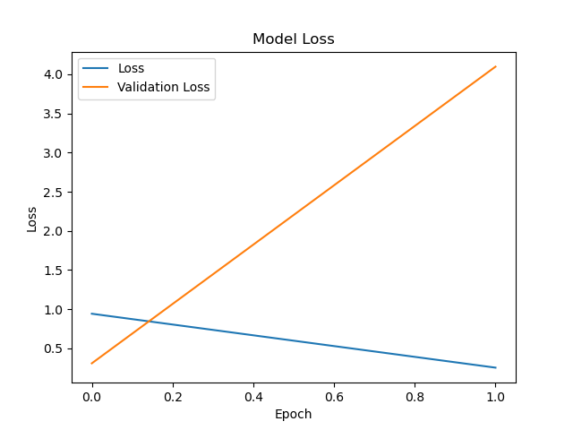
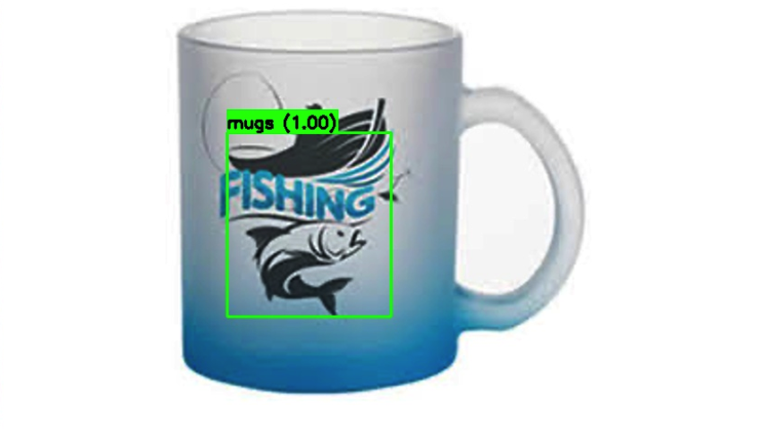
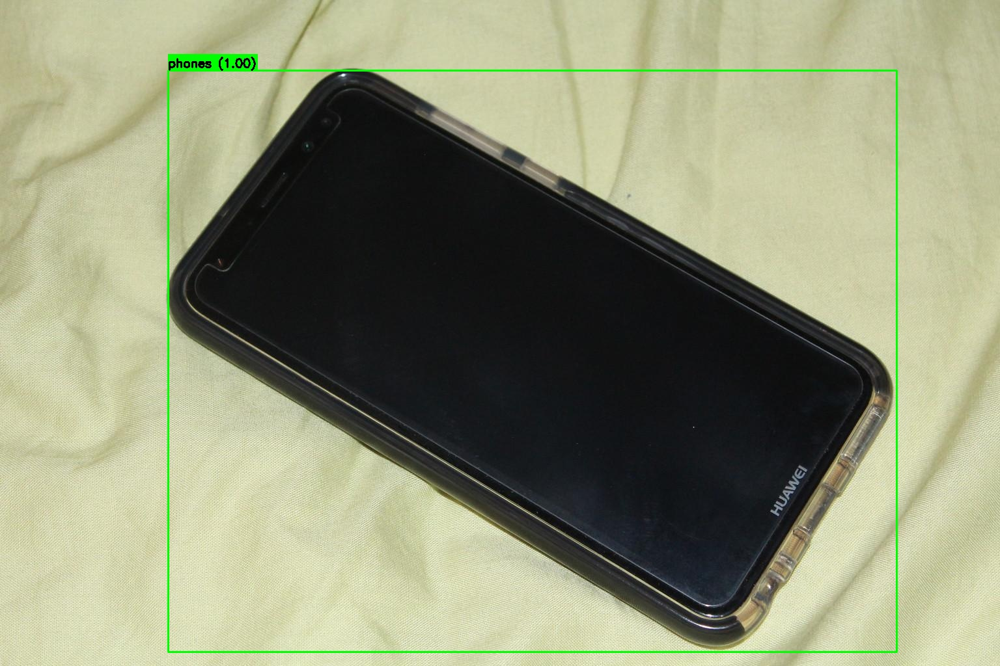
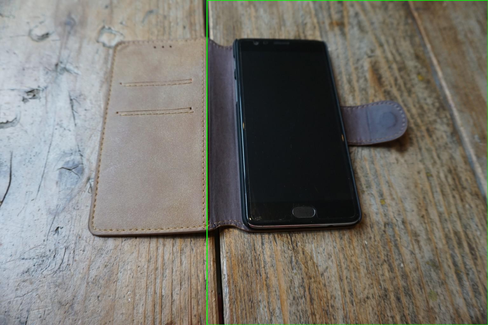
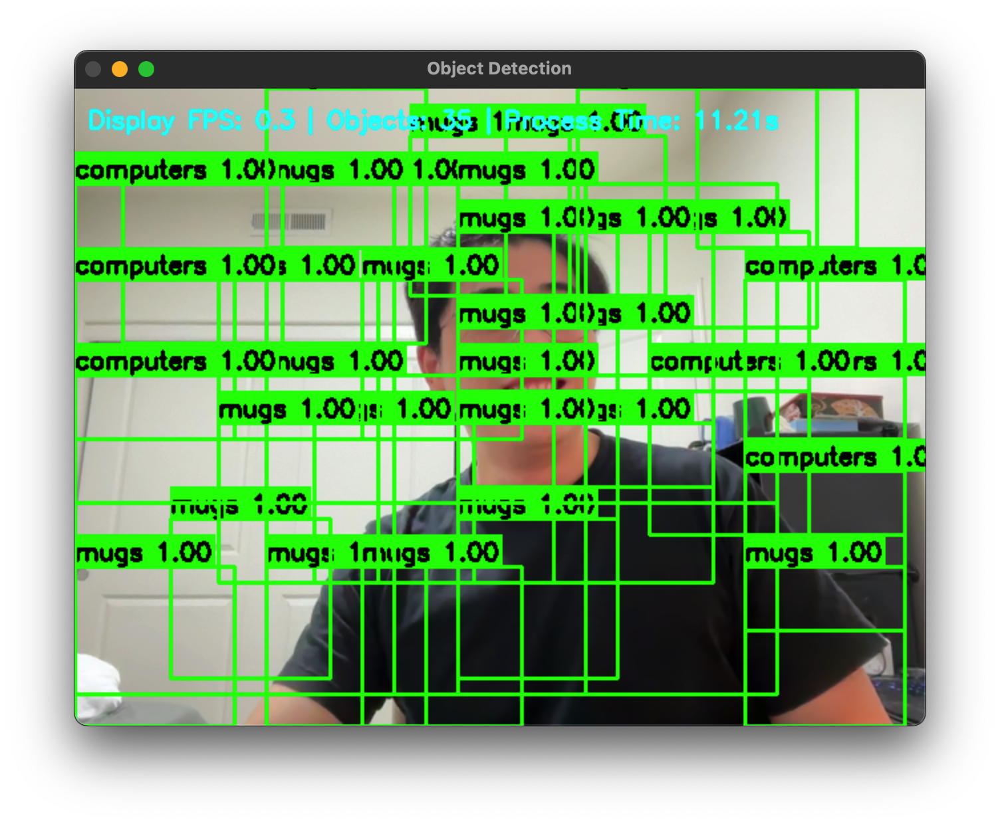

# Multi-Class Object Detection using VGG16 + Selective Search

This project demonstrates an RCNN-style pipeline using **VGG16** and **Selective Search** to detect and classify objects from multiple categories in static images. Additionally, it includes a **real-time webcam detection system** with advanced optimization techniques.

## 📁 Dataset

We built a custom dataset with the following object classes:

- `mugs`
- `computers`
- `phones`

This dataset was originally created during **Mini Project 8**.

- Images were manually labeled using the open-source tool [LabelMe](http://labelme.csail.mit.edu/).
- LabelMe stores annotations as `.json` files.
- These `.json` files were converted to `.csv` format using a custom script: **`json_to_csv.py`**.

### 📄 Conversion Script

```bash
python json_to_csv.py -d "path/to/json_files" 
```

### 🔢 Image Statistics

| Class      | # of Images  |           Annotation Format         |
|------------|--------------|-------------------------------------|
| mugs       | ~115         | CSV (class, xmin, ymin, xmax, ymax) |
| computers  | ~113         | CSV (class, xmin, ymin, xmax, ymax) |
| phones     | ~109         | CSV (class, xmin, ymin, xmax, ymax) |

Images were manually collected from online image search and labeled using [LabelMe](http://labelme.csail.mit.edu/) or manual CSV annotation. Each image has an accompanying CSV file with bounding box coordinates.

## 🧠 Model Architecture

- **Backbone:** Pre-trained `VGG16` from `tf.keras.applications`
- **Classifier Head:** Fully connected layers (`fc1`, `fc2`) with `softmax` activation
- **Region Proposals:** Generated via `cv2.ximgproc.segmentation.createSelectiveSearchSegmentation()`

## 📉 Training

The classifier is trained on crops extracted from ground truth boxes (positives) and randomly selected background proposals (negatives are excluded during training).

### 🔍 Training Details:

- Optimizer: Adam
- Loss: Sparse categorical cross-entropy
- Input size: 224x224
- Epochs: 2
- Batch Size: 16
- Validation Split: 5%

## ⚡ Real-Time Detection Optimization

The project includes an optimized real-time webcam detection system with the following performance enhancements:

### 🎯 Optimized Parameters

| Parameter | Value | Purpose |
|-----------|--------|---------|
| **CONFIDENCE_THRESHOLD** | 0.85 | Reduces false positives |
| **NMS_THRESHOLD** | 0.3 | Eliminates overlapping detections |
| **FRAME_SKIP** | 2 | Process every 2nd frame for better FPS |
| **DETECTION_SIZE** | (224, 224) | Model input resolution |
| **MIN_OBJECT_SIZE** | 80 pixels | Filters small noise detections |
| **SLIDING_WINDOW_SIZES** | [(120,120), (180,180), (240,240)] | Multi-scale detection |
| **STRIDE_RATIO** | 0.25 | Balance between coverage and speed |
| **BATCH_SIZE** | 32 | Efficient GPU utilization |
| **WEBCAM_RESOLUTION** | 640x480 | Optimal quality vs performance |
| **WEBCAM_FPS** | 30 | Smooth video capture |
| **BUFFER_SIZE** | 1 | Reduces latency |

### 🚀 Optimization Techniques

**Detection Optimization:**
- Multi-scale sliding window detection
- Non-Maximum Suppression (NMS) for duplicate removal
- Batch processing for GPU efficiency
- Smart background filtering using variance threshold
- Confidence-based filtering

**Performance Optimization:**
- Threaded processing (separate capture and detection)
- Frame skipping strategy
- Non-blocking queue operations
- Rolling FPS calculation
- Memory-efficient processing

**Visual Smoothing:**
- Alpha fading for old detections
- Last-known-good detection display
- Real-time performance metrics

---

## 📊 Results

### 📈 Training Loss / Validation Loss

<p align="center">
  
</p>


### ⚡ Performance Metrics

| Metric | Value |
|--------|--------|
| **Average FPS** | ~15-20 FPS |
| **Detection Latency** | ~50-100ms |
| **Memory Usage** | ~2-3GB GPU |
| **CPU Usage** | ~30-40% |

---

## ▶️ Execution Screenshots


### 🔍 Test Script Output

<p align="center">
  
</p>

<p align="center">
  
</p>

<p align="center">
  
</p>


### 🖥️ Real-Time Webcam Detection

<p align="center">
  
</p>

---

## 🏁 How to Run

### Prerequisites

- Python 3.7+
- TensorFlow 2.x
- OpenCV 4.x
- Required packages: `numpy`, `cv2`, `tensorflow`

### Setup

Ensure folder "dataset" and model "multi_class_model.h5" are decompressed to the same directory of rcnn_muti.py

Download **dataset_mini9**:
https://drive.google.com/file/d/1dLgaW0MdFVgQxkjUK0Kz0hwjoGm8TRVO/view?usp=sharing

Download **multi_class_model.h5**:
https://drive.google.com/file/d/1bfJr00kwez6XFK4tN2Q3Ylz7e164eyKK/view?usp=sharing

### ✅ Train the Model

```bash
python rcnn_multi.py
```

### ✅ Test the Model (Static Images)

```bash
python rcnn_multi_test.py
```

### 🎥 Real-Time Webcam Detection

```bash
python optimized_webcam_detection.py
```

**Controls:**
- Press `q` to quit
- Press `Space` to pause/resume
- Press `s` to save screenshot

### 📊 Performance Monitoring

The real-time detection system provides live performance metrics:
- FPS counter
- Frame processing count
- Number of detected objects
- Detection confidence scores

---

## 📁 Project Structure

```
├── rcnn_multi.py                   # Training script
├── rcnn_multi_test.py              # Static image testing
├── json_to_csv.py                  # Dataset conversion utility
├── multi_class_model.h5            # Trained model (need download)
├── dataset_mini9/                  # Training dataset (need download)
├── chart_loss.png                  # Training loss curve
├── WebCamSave-rcnn.py              # Training accuracy curve
├── webCam_result.png               # Sample detection results
└── README.md                       # This file
```

## 🔧 Configuration

You can adjust detection parameters in `optimized_webcam_detection.py`:

```python
CONFIDENCE_THRESHOLD = 0.85    # Detection confidence
NMS_THRESHOLD = 0.3           # NMS overlap threshold
FRAME_SKIP = 2                # Frame processing interval
MIN_OBJECT_SIZE = 80          # Minimum detection size
```

## 🎯 Future Improvements

- [ ] Integration with YOLO for faster detection
- [ ] Mobile deployment optimization
- [ ] Additional object classes
- [ ] Real-time training capabilities
- [ ] Cloud-based inference API